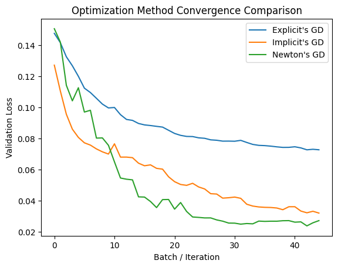
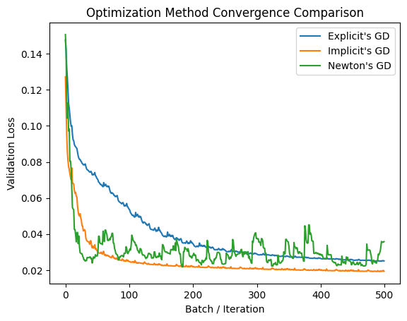

# Discretization of Gradient Flow

## Overview

This repository explores and compares three gradient descent approaches—**Explicit GD**, **Implicit GD**, and **Newton GD**—using only **NumPy** for maximum transparency and control over the gradient flow. The goal is to study their convergence behaviors in depth.

### Models Explanation

- **Explicit GD (Standard Gradient Descent)**

  - **Formula:**  
    $$\theta_{k+1} = \theta_k - \eta \nabla L_k$$
  - **Explanation:**  
    Uses a **first-order (linear) Taylor approximation** of the loss to update parameters. Each step moves along the gradient direction with step size $\eta$. Simple but may struggle with stiff or ill-conditioned loss landscapes.

- **Implicit GD (Backward Euler on Quadratic)**

  - **Formula:**  
    $$\theta_{k+1} = (I + \eta H_k)^{-1} \left(\theta_k + \eta (H_k \theta_k - \nabla L_k)\right)$$
  - **Explanation:**  
    Uses a **second-order (quadratic) Taylor approximation**, effectively taking the curvature of the loss into account. This allows more stable updates, particularly in stiff regions, by solving for the next step implicitly.

- **Newton GD (Newton’s Method)**
  - **Formula:**  
    $$\theta_{k+1} = \theta_k - H_k^{-1} \nabla L_k$$
  - **Explanation:**  
    Also a quadratic approximation, but it **directly jumps to the local optimum** of the quadratic approximation in a single step.
    - **Note:** Damping and Armijo line search are used to prevent instability, as Newton updates can diverge if the Hessian is ill-conditioned or the step overshoots.

### Experiment Objective

- Compare the **advantages and disadvantages** of each gradient descent method.
- Analyze convergence speed and stability using **validation loss** curves over training batches.

### Experiment Results

#### 1. Early Convergence (Initial Steps)

- Observed speed:  
  $$\text{Newton GD} > \text{Implicit GD} > \text{Explicit GD}$$
- **Reason:**
  - Newton GD can jump directly to the optimum of the local quadratic, achieving rapid initial convergence.
  - Implicit GD moves along a precise quadratic path, slower than Newton but faster than explicit GD.
  - Explicit GD follows a rough linear path, making its early convergence the slowest.

<p align="center" style="text-align: center;">
  
  <br>
  <em>Figure 1: Validation loss comparison (batch 0–45, ~0–1 epochs)</em>
</p>

#### 2. Late Convergence (Long-Term Behavior)

- Observed trend:  
  $$\text{Implicit GD} > \text{Explicit GD}, \quad \text{Newton GD is unstable}$$
- **Insights:**
  - Implicit GD’s quadratic approximation ensures fast and **stable convergence**, often faster than explicit GD in the long term. Convergence resembles $\frac{1}{x^2}$ versus $\frac{1}{x}$ for explicit GD.
  - Explicit GD eventually converges but requires much longer training.
  - Newton GD becomes unstable when the loss drops below ~4%, as Hessian sensitivity amplifies noise, causing erratic updates.

#### 3. Conclusion (Long-Term Behavior)

- **Explicit GD**: Slow but safe; eventually converges with enough training.
- **Implicit GD**: Stable and follows a quadratic path; converges faster than explicit GD in the long term.
- **Newton GD**: Extremely fast at the beginning but becomes unstable later due to Hessian sensitivity and noise amplification.

<p align="center" style="text-align: center;">
  
  <br>
  <em>Figure 2: Validation loss comparison over extended training</em>
</p>

## Project Structure

```bash
Project/
├── Custom_library/
│    │
│    ├── core/               # The absolute fundamentals of all models
│    │   ├── baseLrModels.py             # base models funciton: getHistory(), predict(), save(), etc.
│    │   └── baseLrModelsImplementHessain.py         # implement compute tools: computeLoss(), computeGradient(), computeHessain()
│    │
│    ├── layers/             # Pure layer implementations
│    │   ├── denseLayer.py
│    │   └── activationLayer.py
│    │
│    ├── models/             # Training *strategies*
│    │   ├── explicitLrModel.py
│    │   ├── implicitLrModel.py
│    │   ├── newtonLrModel.py
│    │   └── optimizeNewtonLrModel.py
│    │
│    └── utils/              # Tools, not ML logic
│        ├── history.py
│        ├── metrics.py
│        └── dataUtils.py
│
├── main.ipynb      # Experiment lab, including all process
│
└── README.md       # Experiment report, including all description
```
